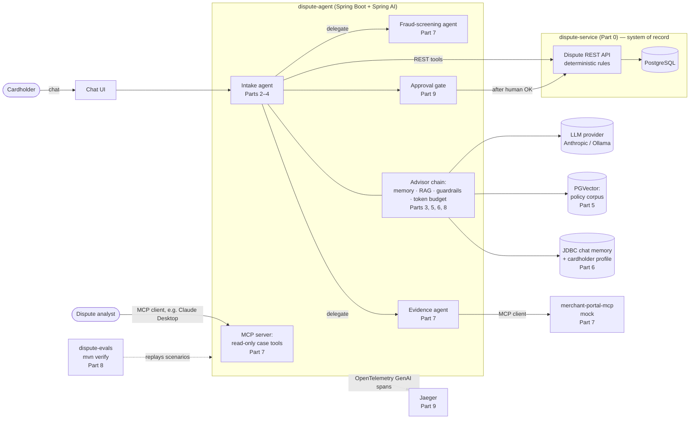
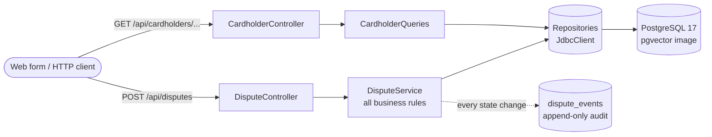
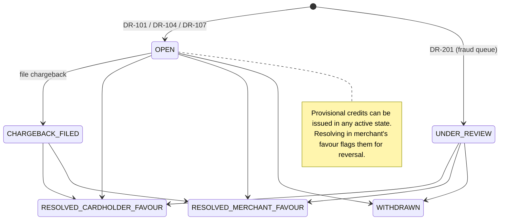

# DisputeDesk — Architecture

> Reference system for the blog series **"Architecting and Implementing AI-Native Enterprise Systems in Java."**
> Meridian Bank, its cardholders, merchants and reason codes are fictional. No real card-network rules are used.

## 1. The problem

A cardholder sees a charge they think is wrong. Today at Meridian Bank they fill in a web form that asks them to:

1. find the exact transaction,
2. choose a reason code (duplicate? not received? cancelled subscription? fraud?),
3. supply reason-specific evidence (for a duplicate: the ID of the *other* charge).

Most people get step 2 wrong and give up at step 3. The result is abandoned claims, wrongly classified claims (a cryptic statement descriptor filed as "fraud"), and analysts re-doing intake by phone.

The rules that decide whether a dispute is valid are **not** the problem. They are precise, auditable, and correct. The problem is the **gap between how humans describe a problem and what the system needs to act on it**. That gap is where an LLM earns its place — and nowhere else.

## 2. What "AI-native" means in this series

An AI-native system is not "a system with a chatbot." It is a system designed from the start around the fact that some of its components are probabilistic. Seven principles run through every part:

| # | Principle | First appears |
|---|-----------|---------------|
| P1 | **Deterministic core, probabilistic edge.** Code constrains everything it can; the model decides only what is genuinely open. | Part 0 |
| P2 | **Tools are contracts.** Names, descriptions, schemas and error codes are the API the model reads. | Part 0 (error codes), Part 4 |
| P3 | **The model proposes, code disposes.** Every write goes through the same rules a human would hit. | Part 2 |
| P4 | **Ground every claim.** Policy answers cite the policy paragraph or are not given. | Part 5 |
| P5 | **Memory is a cache, not a record.** The `disputes` table is truth; the conversation is context. | Part 6 |
| P6 | **Evals are the test suite.** A prompt change without an eval run is an untested deploy. | Part 4, Part 8 |
| P7 | **Autonomy is earned.** Read-only → reversible-with-approval → autonomous, per action. | Part 9 |

## 3. Target architecture (end of Part 9)



### Component-by-part map

| Component | Module | Introduced | Hardened |
|-----------|--------|-----------|----------|
| Dispute REST API + rules | `dispute-service` | Part 0 | Part 4 (idempotency), Part 9 (authN/Z) |
| Complaint classifier | `dispute-agent` | Part 1 | Part 8 |
| Hand-written agent loop (no framework) | `dispute-agent` (`raw` package) | Part 2 | — (kept as teaching reference) |
| Spring AI agent, advisors, tools | `dispute-agent` | Part 3 | Parts 4–9 |
| Tool contracts + first eval | `dispute-agent`, `dispute-evals` | Part 4 | Part 8 |
| Policy RAG (PGVector, hybrid search, citations) | `dispute-agent` | Part 5 | Part 9 (injection) |
| JDBC chat memory, cardholder profile | `dispute-agent` | Part 6 | — |
| MCP server (analyst tools), MCP client (merchant portal), sub-agents | `dispute-agent`, `merchant-portal-mcp` | Part 7 | Part 9 (scopes) |
| Eval harness, Resilience4j, cost ceilings | `dispute-evals`, `dispute-agent` | Part 8 | — |
| Injection suite, OTel → Jaeger, approval gate | all | Part 9 | — |

## 4. Part 0 architecture (what exists today)



### Dispute lifecycle



### API surface (the agent's future tools)

| Method | Path | Purpose | Becomes tool in |
|--------|------|---------|-----------------|
| GET | `/api/cardholders/{id}` | Cardholder profile | Part 6 |
| GET | `/api/cardholders/{id}/transactions?days=` | Recent transactions with refunded amount | Part 2 (the first tool) |
| GET | `/api/cardholders/{id}/transactions/{txnId}` | One transaction | Part 3 |
| GET | `/api/cardholders/{id}/disputes` | Dispute history | Part 3 |
| POST | `/api/disputes` | File a dispute | Part 3 |
| GET | `/api/disputes/{id}` | Dispute + events + credits | Part 3 |
| POST | `/api/disputes/{id}/provisional-credits` | Issue provisional credit | Part 4 (and gated in Part 9) |
| POST | `/api/disputes/{id}/chargeback` | Send to acquirer | Part 7 (analyst MCP) |
| POST | `/api/disputes/{id}/resolution` | Resolve | Analyst only — never an agent tool |

Rule violations return RFC 9457 problem details with a stable `errorCode`, for example:

```json
{
  "type": "https://disputedesk.example/errors/filing-window-expired",
  "title": "FILING_WINDOW_EXPIRED",
  "status": 422,
  "detail": "DR-104 must be filed within 120 days of posting; TXN-100107 posted on 2026-04-23",
  "errorCode": "FILING_WINDOW_EXPIRED"
}
```

## 5. Architecture decisions

### ADR-001 — The agent wraps the existing system over its REST API; it never touches the database

**Context.** We could let the agent call `DisputeService` in-process, or even query tables directly.
**Decision.** The agent is a separate deployable. Its tools call `dispute-service` over HTTP.
**Why.** This is how AI arrives in real enterprises: in front of systems that already work, owned by other teams. It keeps every rule (P1, P3) in one place, gives us a hard trust boundary for Part 9, makes the MCP story in Part 7 natural, and lets the talk's "From REST APIs to AI Agents" framing be literally true.
**Cost.** One extra network hop per tool call. Measured in Part 3; negligible next to LLM latency.

### ADR-002 — Readable, prefixed identifiers (`TXN-100103`, `DSP-10001`)

**Why.** An LLM will read and emit these IDs. Short prefixed IDs are easier for the model to copy correctly, easier to spot in traces, and easier to assert on in evals. A transposed UUID is invisible; a transposed `TXN-100130` fails loudly.

### ADR-003 — Plain `JdbcClient`, no ORM

**Why.** Every SQL statement is visible in the source, which matters for a teaching series whose theme is "nothing hidden." It also keeps the Spring Boot 4 upgrade surface small.

### ADR-004 — Seed data uses dates relative to `now()`

**Why.** Filing windows are time-based. Absolute dates would make scenarios silently rot a few months after publication, breaking both reader demos and the Part 8 eval suite.

### ADR-005 — Non-idempotent provisional credit is left in deliberately

**Why.** Part 4 demonstrates, with a real agent, how a retried tool call double-credits a customer, then fixes it with an `Idempotency-Key`. The bug is documented in code and pinned by `knownIssue_retriedPartialCreditIsAppliedTwice_fixedInPart4`.

### ADR-006 — Pinned platform versions for the whole series

Java 25 (LTS) · Spring Boot 4.1.x · Spring AI 2.0.x · PostgreSQL 17 + pgvector. No upgrades mid-series.

## 6. Repository layout and branching

```
disputedesk/
├── pom.xml                   parent; version pins
├── docker-compose.yml        postgres (pgvector) — Part 9 adds jaeger
├── dispute-service/          Part 0: system of record
├── dispute-agent/            Part 1+
├── merchant-portal-mcp/      Part 7
├── dispute-evals/            Part 8
├── docs/                     architecture, scenarios
└── http/                     runnable request scripts per part
```

Each part is a git tag: `part-00`, `part-01`, … Every blog post links to its tag, so readers always see code that matches the text.
